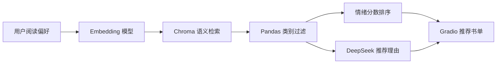

# Semantic Book Recommender

基于语义向量检索、情感分析和 LLM 推荐语生成的智能图书推荐系统。用户输入一段阅读偏好，系统会从图书描述中做语义召回，再按类别和情绪基调筛选排序，最后通过 Gradio 展示推荐书单和图书详情。

## 项目亮点

- 语义搜索：使用 `BAAI/bge-small-en-v1.5` 生成文本向量，并用 Chroma 做相似度检索。
- 多维推荐：支持类别过滤，以及 Happy、Surprising、Angry、Suspenseful、Sad 等情绪基调排序。
- LLM 解释：配置 `DEEPSEEK_API_KEY` 后，可为推荐结果生成中文推荐理由。
- 可复现流程：保留数据清洗、分类、情感分析、向量检索 Notebook，并提供向量库重建脚本。
- 展示友好：Gradio Web UI 支持封面画廊、点击查看详情，适合作为求职作品集项目。

## 技术栈

- Python, Pandas, NumPy
- Gradio
- LangChain, Chroma
- HuggingFace Sentence Transformers
- Transformers 情感分类 Pipeline
- DeepSeek Chat API

## 系统流程



## 目录结构

```text
.
├── app.py                         # 应用启动入口
├── gradio-dashboard.py            # Gradio 推荐系统主程序
├── scripts/
│   └── build_vector_db.py          # 从 tagged_description.txt 重建 Chroma 向量库
├── data-exploration.ipynb          # 数据探索与清洗
├── text-classification.ipynb       # 图书类别处理
├── sentiment-analysis.ipynb        # 图书描述情感分析
├── vector-search.ipynb             # 向量检索实验
├── books_cleaned.csv               # 清洗后的图书数据
├── books_with_categories.csv       # 带类别标签的数据
├── books_with_emotions.csv         # 带情绪分数的数据
├── tagged_description.txt          # 向量检索文本语料
└── cover-not-found.jpg             # 缺失封面占位图
```

## 快速开始

```bash
python -m venv .venv
.venv\Scripts\activate
pip install -r requirements.txt
copy .env.example .env
python scripts/build_vector_db.py
python app.py
```

启动后在浏览器打开 Gradio 输出的本地地址，输入英文阅读描述，例如：

```text
A story about forgiveness and family secrets
```

## 环境变量

| 变量 | 必填 | 说明 |
| --- | --- | --- |
| `DEEPSEEK_API_KEY` | 否 | 配置后启用中文推荐理由生成；不配置也可以运行语义推荐。 |
| `BOOK_EMBEDDING_MODEL_PATH` | 否 | 指向本地 `bge-small-en-v1.5` 模型目录，用于离线运行。 |
| `HF_HOME` | 否 | 自定义 Hugging Face 模型缓存目录。 |

## 数据与向量库

仓库包含清洗后的 CSV 和检索语料，`chroma_db/` 是可生成的二进制索引，因此不提交到 Git。首次运行前执行：

```bash
python scripts/build_vector_db.py
```

如果需要重新生成索引：

```bash
python scripts/build_vector_db.py --rebuild
```

## Notebook 流程

1. `data-exploration.ipynb`：加载原始图书元数据，清洗缺失值和字段。
2. `text-classification.ipynb`：整理图书类别，生成简化类别标签。
3. `sentiment-analysis.ipynb`：对图书描述进行情绪打分。
4. `vector-search.ipynb`：构建语义检索语料，验证 Chroma 召回效果。

## 求职展示建议

- 在 README 顶部补一张运行截图，可以直接展示检索框、推荐封面和 AI 推荐理由。
- 在 GitHub 仓库 About 区域添加 topics：`semantic-search`、`recommendation-system`、`gradio`、`langchain`、`chroma`。
- 若部署到 Hugging Face Spaces 或云服务器，可在 README 顶部添加在线 Demo 链接。

## License

本项目代码使用 MIT License。数据文件请按其原始来源授权范围使用。
