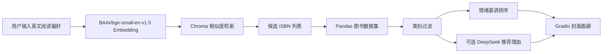

# Architecture

Semantic Book Recommender 是一个轻量级推荐系统项目，核心思路是先用语义向量召回候选图书，再用结构化字段和情绪分数做二次排序，最后通过 Gradio 提供交互式展示。

## 模块分层

```text
.
|-- app.py                       # 启动入口，转发到 Gradio 主程序
|-- gradio-dashboard.py          # 在线推荐、LLM 推荐语、Gradio UI
|-- scripts/build_vector_db.py    # 可重复构建 Chroma 向量库
|-- *.ipynb                      # 数据探索、分类、情绪分析、向量检索实验
|-- books_*.csv                  # 已清洗、分类和情绪打分的数据资产
|-- tagged_description.txt        # 向量检索语料
|-- .env.example                 # 运行配置示例
|-- requirements.txt              # Python 依赖
```

数据处理 Notebook 保留可追溯流程，运行入口保持简单，生成型资产 `chroma_db/` 和模型缓存通过 `.gitignore` 排除。

## 运行时数据流



关键点：

- `books_with_emotions.csv` 是线上推荐的主数据源，包含类别、情绪分数和封面信息。
- `tagged_description.txt` 是构建向量库的输入，首次运行前由 `scripts/build_vector_db.py` 生成 `chroma_db/`。
- `DEEPSEEK_API_KEY` 是可选能力；未配置时系统仍然可以完成语义推荐。
- `BOOK_EMBEDDING_MODEL_PATH` 和 `HF_HOME` 用于离线或自定义模型缓存场景。

## 数据资产策略

仓库提交了处理后的 CSV 和检索语料。以下内容属于本地生成物，并通过 `.gitignore` 排除：

- `chroma_db/`：由脚本从文本语料重建。
- `models/`：模型缓存体积大，适合放在 Hugging Face 缓存或本地目录。
- `.env`：包含 API Key 或本机路径。
- `.ipynb_checkpoints/`、日志、虚拟环境目录。

这些规则已经在 `.gitignore` 中覆盖。
